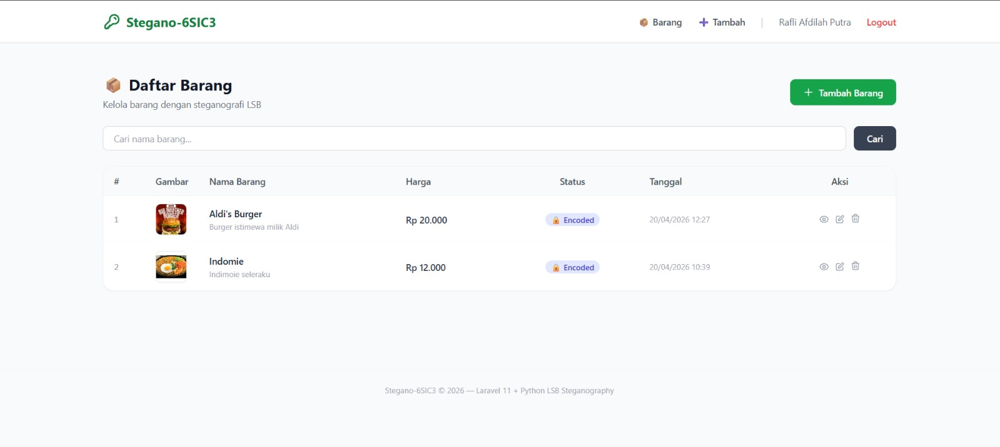
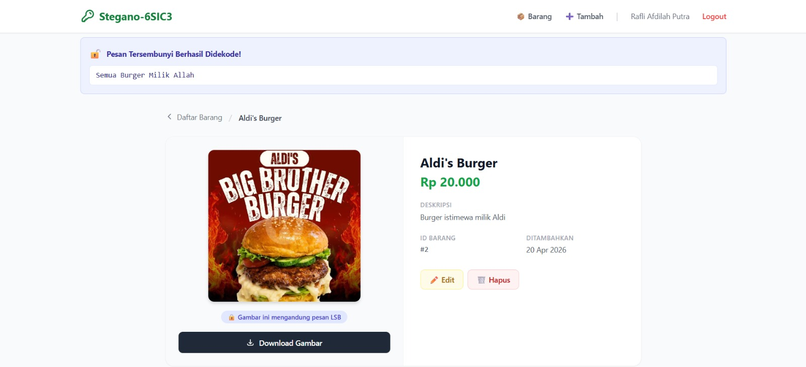

🔐 Stegano-6SIC3 — Laravel 11 + Python LSB Steganography

  

---

📌 Tentang Project

Stegano-6SIC3 adalah aplikasi web berbasis Laravel 11 yang digunakan untuk:

- Mengelola data barang (CRUD)
- Mengupload dan download gambar
- Menyembunyikan pesan rahasia dalam gambar
- Mengekstrak pesan tersembunyi dari gambar

Aplikasi ini mengimplementasikan metode LSB (Least Significant Bit) Steganography dengan integrasi Python.

---

👨‍💻 Anggota Kelompok 1

No| Nama
1| Imam Syahputra
2| Mhd. Arsyad Marfah
3| Ananda Maulana Ibrahim
4| Rafli Afdillah Putra

---

⚙️ Teknologi yang Digunakan

- ⚡ Laravel 11
- 🐘 PHP 8.2+
- 🐍 Python 3 (Pillow)
- 🗄️ SQLite / MySQL
- 🎨 HTML, CSS, JavaScript
- 🔐 Laravel Breeze (Authentication)
- 🔁 Symfony Process (Integrasi Python)

---

✨ Fitur Utama

- 🔐 Encode pesan ke dalam gambar (LSB)
- 🔓 Decode pesan dari gambar
- 📂 Upload & Download gambar
- 📊 CRUD data barang
- 🔎 Pencarian data barang
- 👤 Sistem login & autentikasi

---

🖼️ Preview Aplikasi

📊 Halaman Daftar Barang

  

🔓 Decode Pesan dari Gambar

  

«📌 Pastikan kamu menyimpan screenshot di folder "docs/" dengan nama sesuai di atas.»

---

🚀 Cara Menjalankan Project

1. Clone Repository

git clone https://github.com/username/stegano-6sic3.git
cd stegano-6sic3

2. Install Dependency

composer install
npm install

3. Konfigurasi Environment

cp .env.example .env
php artisan key:generate

Edit ".env":

DB_CONNECTION=sqlite

PYTHON_BIN=python3
STEGANO_SCRIPT_PATH=python/steganography.py

---

4. Setup Database

touch database/database.sqlite
php artisan migrate
php artisan storage:link

---

5. Install Python Library

pip install Pillow

---

6. Jalankan Aplikasi

npm run dev
php artisan serve

Buka di browser:

http://localhost:8000

---

🔄 Cara Kerja Steganografi

🔐 Encode

1. User upload gambar + pesan
2. Laravel memproses input
3. Python menyisipkan pesan ke pixel gambar (LSB)
4. Gambar disimpan sebagai encoded

🔓 Decode

1. User memilih gambar
2. Laravel memanggil Python
3. Python membaca LSB pixel
4. Pesan ditampilkan ke user

---

🔒 Keamanan

- Validasi file upload (PNG/JPG)
- Proteksi CSRF
- Middleware autentikasi
- Eksekusi Python aman via Symfony Process

---

📖 Lisensi

Project ini dibuat untuk keperluan pembelajaran.

---

✨ Dibuat oleh Kelompok 1 - 6SIC3 ✨

